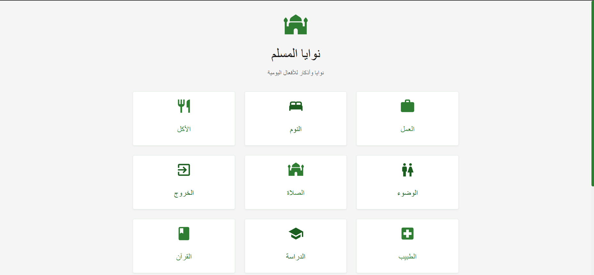
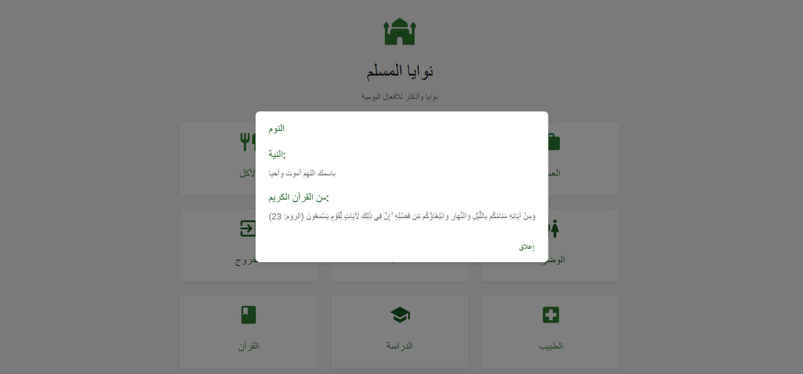

# NiyyahFirst

A platform to help Muslims set and maintain their intentions (niyyah) for daily actions, turning everyday habits into acts of worship.
## Getting Started





## Features

- **Niyyah Library**: Browse categorized intentions for various actions
- **Personal Dashboard**: Track your intentions and spiritual growth
- **Smart Reminders**: Get timely notifications to set your intentions
- **Group Niyyah**: Share intentions with family or team members
- **AI Suggestions**: Get personalized intention suggestions

## Getting Started

### Prerequisites

- Node.js (v14 or higher)
- npm (v6 or higher)

### Installation

1. Clone the repository:
```bash
git clone https://github.com/yourusername/niyyahfirst.git
cd niyyahfirst
```

2. Install dependencies:
```bash
npm install
```

3. Start the development server:
```bash
npm run dev
```

4. Open [http://localhost:3000](http://localhost:3000) in your browser.

## Built With

- [React](https://reactjs.org/) - JavaScript library for building user interfaces
- [TypeScript](https://www.typescriptlang.org/) - Typed JavaScript
- [Material-UI](https://mui.com/) - React UI framework
- [Vite](https://vitejs.dev/) - Next Generation Frontend Tooling

## Contributing

Contributions are welcome! Please feel free to submit a Pull Request.

## License

This project is licensed under the ISC License.

## Acknowledgments

- Islamic scholars and teachers for their guidance on intentions
- The Muslim community for their support and feedback 
